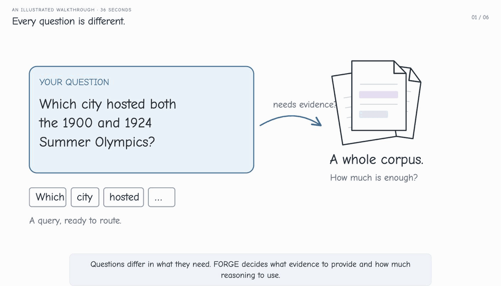

<div align="center">


# FORGE

### Form-Optimal Routing of Grounded Evidence for Frozen LLM Agents

*“Choose the evidence. Set the reasoning. Keep the model frozen.”*

Xi Xiao · Yunbei Zhang · Chen Liu · Lin Zhao · Jialin Chen<br>
Tianchen Zhao · Xiang Xu · Youngeun Kim · Tianyang Wang · Min Xu

[](https://xixiaouab.github.io/projects/FORGE/assets/FORGE.pdf)
[](https://xixiaouab.github.io/projects/FORGE/)
[](pyproject.toml)
[](LICENSE)

[Overview](#overview) · [Quick Start](#quick-start) · [Workflow](#workflow) · [Documentation](#documentation) · [Citation](#citation)



</div>

## Overview

FORGE learns **what evidence to provide** and **how much reasoning to use** for each question. A lightweight factorized router selects an evidence form and a thinking setting around a frozen language model, balancing answer quality with input and output token costs.

| Component | Design |
| :--- | :--- |
| Evidence | Direct, deterministic extractive Summary, or top-3 BM25 Raw passages |
| Thinking | NoThink, CoT-Prompt, or supported native thinking budgets of 1,024 / 4,096 tokens |
| Router | Two-layer MLP with a support head and a conditional thinking head |
| Training | Offline action enumeration → supervised forward-KL distillation → group-relative policy refinement |
| Hosts | OpenAI-compatible HTTP, Anthropic HTTP, and recorded-response replay |
| Evaluation | Token F1, exact match, Cached / Fresh Online accounting, and paired bootstrap comparisons |

<details>
<summary><strong>Feature Variants and Action Order</strong></summary>

| Variant | Feature Dimensions | Host Probe Calls |
| :--- | ---: | ---: |
| BGE+BM25 | 773 | 0 |
| Lite | 778 | 0 |
| Full | 789 | 4 |

Full uses one greedy probe and three self-consistency probes before the routed answer. The four probes run concurrently, subject to the provider's rate limits.

The primary setup has six actions for non-thinking hosts and twelve for thinking-capable hosts. Actions use support-major order: `support * n_thinking + thinking`, with support `[Direct, Summary, Raw]` and thinking `[NoThink, CoT-Prompt, Think-Low, Think-High]`.

</details>

## Quick Start

Use Python 3.11 or later.

```sh
git clone https://github.com/xixiaouab/FORGE-code.git
cd FORGE-code
python3 -m venv .venv
source .venv/bin/activate
python -m pip install -e '.[embeddings,test]'
forge --help
```

Run the local test suite:

```sh
pytest -q
```

The tests use synthetic fixtures and a localhost HTTP server. The embedding model loads on first feature extraction; model weights and benchmark data are obtained separately under their original licenses.

> [!TIP]
> Follow the [end-to-end workflow](docs/workflow.md) for a complete HotpotQA example, from local data import to training and evaluation.

## Workflow

| Step | Command | Output |
| :--- | :--- | :--- |
| Prepare Data | `forge import` · `forge split` | Canonical JSONL and recorded split manifests |
| Configure Host | Edit `configs/host.example.yaml` | Frozen-host endpoint and inference settings |
| Enumerate Actions | `forge stage0` | Features, answer outcomes, and token usage |
| Distill the Router | `forge train` | Stage-1 checkpoint fitted on training data |
| Refine the Policy | `forge refine` | Stage-2 checkpoint from sampled host feedback |
| Evaluate | `forge cached-eval` · `forge infer` · `forge evaluate` | Per-query results and benchmark summaries |
| Compare | `forge compare` | Paired bootstrap estimates |

[Full commands and data formats →](docs/workflow.md)

## Documentation

| Guide | Contents |
| :--- | :--- |
| [End-to-End Workflow](docs/workflow.md) | Data import, host configuration, training, and evaluation commands |
| [Method Details](docs/method-decisions.md) | Features, prompts, retrieval, adapters, and accounting |
| [Training](docs/training.md) | Objectives, sampling, normalization, and checkpoint structure |
| [Evaluation](docs/evaluation.md) | Metrics, aggregation, and paired uncertainty |
| [Experiment Recipes](docs/experiments.md) | Feature variants, action alphabets, cost weights, and ablations |

## Citation

```bibtex
@article{xiao2026forge,
  title={FORGE: Form-Optimal Routing of Grounded Evidence for Frozen LLM Agents},
  author={Xiao, Xi and Zhang, Yunbei and Liu, Chen and Zhao, Lin and Chen, Jialin and Zhao, Tianchen and Xu, Xiang and Kim, Youngeun and Wang, Tianyang and Xu, Min},
  year={2026},
  note={Preprint},
  url={https://xixiaouab.github.io/projects/FORGE/}
}
```

## License

The code is released under the [MIT License](LICENSE).

## Contact

[Xi Xiao](https://xixiaouab.github.io/) · [xxiao@uab.edu](mailto:xxiao@uab.edu)
